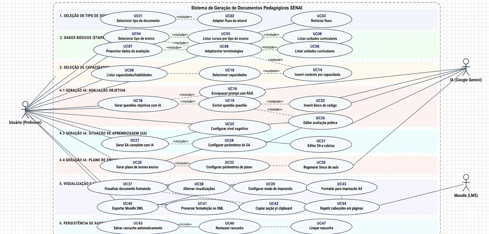

# Requisitos do Sistema — Gerador Inteligente SENAI

**Versão:** 0.7.0
**Data:** Março/2026
**Autor:** Natan Rubenich

---

## 1. Introdução

Este documento especifica os requisitos funcionais e não funcionais do sistema **Gerador Inteligente SENAI**, uma aplicação web para geração automatizada de avaliações e documentos pedagógicos com Inteligência Artificial, alinhados à Metodologia SENAI de Educação Profissional (MSEP) e ao padrão SAEP.

### 1.1 Escopo

O sistema atende docentes do SENAI na elaboração de:

- Avaliações objetivas (múltipla escolha)
- Avaliações práticas (situação-problema com critérios)
- Situações de aprendizagem (projetos pedagógicos com rubrica)
- Planos de ensino (planejamento completo de unidades curriculares)

### 1.2 Definições e Siglas

| Sigla | Significado |
|-------|-------------|
| **MSEP** | Metodologia SENAI de Educação Profissional |
| **SAEP** | Sistema de Avaliação da Educação Profissional |
| **UC** | Unidade Curricular |
| **SA** | Situação de Aprendizagem |
| **PPC** | Projeto Pedagógico de Curso |
| **RAG** | Retrieval-Augmented Generation |
| **LLM** | Large Language Model |
| **CT** | Capacidade Técnica |
| **CB** | Capacidade Básica |
| **SGN** | Sistema de Gestão Nacional (SENAI) |

---

## 2. Requisitos Funcionais

### Diagrama de Caso de Uso

O diagrama abaixo apresenta a visão geral dos casos de uso do sistema, seus atores (Usuário/Professor, IA Google Gemini e Moodle LMS) e os relacionamentos entre os casos de uso.

### 2.1 Seleção de Tipo de Documento

| ID | Requisito | Prioridade |
|----|-----------|------------|
| RF-01 | O sistema deve permitir ao usuário selecionar o tipo de documento a ser gerado: Avaliação Objetiva, Avaliação Prática, Situação de Aprendizagem ou Plano de Ensino. | Essencial |
| RF-02 | O sistema deve adaptar o fluxo de etapas (wizard de 4 passos) conforme o tipo de documento selecionado. | Essencial |
| RF-03 | O sistema deve permitir ao usuário retornar à tela de seleção a qualquer momento, reiniciando o fluxo. | Essencial |

### 2.2 Dados Básicos (Etapa 1)

| ID | Requisito | Prioridade |
|----|-----------|------------|
| RF-04 | O sistema deve permitir a seleção do tipo de ensino: Técnico ou Integrado ao Ensino Médio (SESI/SENAI). | Essencial |
| RF-05 | O sistema deve listar os cursos cadastrados no banco de dados, filtrados pelo tipo de ensino selecionado. | Essencial |
| RF-06 | O sistema deve listar as unidades curriculares (UCs) do curso selecionado. | Essencial |
| RF-07 | O sistema deve permitir o preenchimento de turma, nome do professor e data da avaliação. | Essencial |
| RF-08 | O sistema deve adaptar a terminologia conforme o tipo de ensino: "Capacidade" para Técnico e "Habilidade" para Integrado. | Essencial |

### 2.3 Seleção de Capacidades (Etapa 2)

| ID | Requisito | Prioridade |
|----|-----------|------------|
| RF-09 | O sistema deve listar as capacidades técnicas e básicas (ou habilidades) da UC selecionada, carregadas do banco de dados. | Essencial |
| RF-10 | O sistema deve permitir a seleção de uma ou mais capacidades para a geração do documento. | Essencial |
| RF-11 | O sistema deve permitir a configuração da quantidade de questões a serem geradas (avaliação objetiva). | Essencial |
| RF-12 | O sistema deve permitir a seleção dos níveis de dificuldade: Fácil, Médio e Difícil. | Essencial |
| RF-13 | O sistema deve permitir a inserção de um assunto/tema para direcionar a geração das questões. | Desejável |
| RF-14 | O sistema deve permitir a inserção de um contexto adicional por capacidade para gerar questões mais específicas com IA. | Desejável |

### 2.4 Geração com IA (Etapa 3)

#### 2.4.1 Avaliação Objetiva

| ID | Requisito | Prioridade |
|----|-----------|------------|
| RF-15 | O sistema deve gerar questões de múltipla escolha com IA (Google Gemini) seguindo o padrão SAEP: contexto situacional, comando e 4 alternativas (a, b, c, d). | Essencial |
| RF-16 | O sistema deve utilizar RAG para enriquecer os prompts com a base de conhecimento da metodologia SENAI. | Essencial |
| RF-17 | O sistema deve gerar questões com respostas distribuídas equilibradamente entre as alternativas. | Essencial |
| RF-18 | O sistema deve permitir a edição individual de cada questão gerada (enunciado, alternativas e resposta correta). | Essencial |
| RF-19 | O sistema deve permitir a exclusão de questões geradas. | Essencial |
| RF-20 | O sistema deve permitir a criação manual de novas questões. | Essencial |
| RF-21 | O sistema deve permitir a geração de questões extras via modal "Gerar + com IA", com seleção de capacidades e contexto. | Desejável |
| RF-22 | O sistema deve suportar a inserção de imagens (URL ou upload) nas questões. | Desejável |
| RF-23 | O sistema deve suportar a inserção de blocos de código com syntax highlighting nas questões e alternativas. | Desejável |

#### 2.4.2 Avaliação Prática

| ID | Requisito | Prioridade |
|----|-----------|------------|
| RF-24 | O sistema deve gerar uma avaliação prática com IA contendo: situação-problema, contexto, instruções, critérios de avaliação e lista de verificação (checklist). | Essencial |
| RF-25 | O sistema deve permitir a configuração do nível cognitivo (Taxonomia de Bloom), tempo de execução e contexto da avaliação prática. | Essencial |
| RF-26 | O sistema deve permitir a edição completa da avaliação prática gerada. | Essencial |

#### 2.4.3 Situação de Aprendizagem (SA)

| ID | Requisito | Prioridade |
|----|-----------|------------|
| RF-27 | O sistema deve gerar uma SA completa com IA contendo: título, tema, desafio, atividades, recursos, cronograma e rubrica de avaliação. | Essencial |
| RF-28 | O sistema deve permitir a configuração de: carga horária, tema, estratégia pedagógica, nível de dificuldade e tipo de rubrica (gradual ou dicotômica). | Essencial |
| RF-29 | O sistema deve gerar rubricas graduais com 4 níveis descritivos (Abaixo do Básico, Básico, Adequado, Avançado) e pesos por critério. | Essencial |
| RF-30 | O sistema deve gerar rubricas dicotômicas com critérios de atendeu/não atendeu. | Essencial |
| RF-31 | O sistema deve permitir a edição completa da SA e da rubrica geradas. | Essencial |

#### 2.4.4 Plano de Ensino

| ID | Requisito | Prioridade |
|----|-----------|------------|
| RF-32 | O sistema deve gerar um plano de ensino completo com IA, contendo: blocos de aulas, estratégias didáticas, instrumentos de avaliação e ambientes pedagógicos. | Essencial |
| RF-33 | O sistema deve permitir a configuração de: carga horária total, período letivo, ambientes, instrumentos e ferramentas. | Essencial |
| RF-34 | O sistema deve calcular automaticamente a distribuição de blocos de aulas com base na carga horária. | Essencial |
| RF-35 | O sistema deve permitir a regeneração individual de blocos de aula com IA. | Desejável |
| RF-36 | O sistema deve permitir a edição completa do plano de ensino gerado. | Essencial |

### 2.5 Visualização e Exportação (Etapa 4)

| ID | Requisito | Prioridade |
|----|-----------|------------|
| RF-37 | O sistema deve exibir o documento gerado em formato visual formatado, pronto para impressão. | Essencial |
| RF-38 | O sistema deve permitir alternar entre visualizações: avaliação e gabarito (objetiva), avaliação e checklist (prática), SA e rubrica (SA). | Essencial |
| RF-39 | O sistema deve oferecer modos de impressão flexíveis: somente avaliação, somente gabarito/rubrica, ou ambos. | Essencial |
| RF-40 | O sistema deve exportar questões objetivas no formato Moodle XML, compatível com importação direta no Moodle. | Essencial |
| RF-41 | A exportação Moodle XML deve preservar imagens e blocos de código com formatação HTML estilizada. | Desejável |
| RF-42 | O sistema deve permitir copiar seções do documento para a área de transferência. | Desejável |
| RF-43 | O sistema deve formatar documentos para impressão no padrão A4 com cabeçalho institucional SENAI. | Essencial |
| RF-44 | O sistema deve repetir o cabeçalho de tabelas em cada página na impressão (ex: rubrica com muitos critérios). | Desejável |

### 2.6 Persistência de Rascunho

| ID | Requisito | Prioridade |
|----|-----------|------------|
| RF-45 | O sistema deve salvar automaticamente o estado do wizard (dados preenchidos, questões geradas) em `localStorage`. | Essencial |
| RF-46 | O sistema deve restaurar automaticamente o rascunho salvo ao reabrir a aplicação. | Essencial |
| RF-47 | O sistema deve limpar o rascunho ao iniciar uma nova avaliação ou ao concluir o fluxo. | Essencial |

### 2.7 Administração de Cursos

> **⚠️ MVP / Provisório:** O painel de administração e o fluxo de upload de documentos descritos nesta seção representam uma solução temporária para validação do MVP. Em versões futuras, este módulo será substituído por uma interface administrativa dedicada com autenticação, controle de acesso por perfil e integração direta com os sistemas institucionais do SENAI.

| ID | Requisito | Prioridade |
|----|-----------|------------|
| RF-48 | O sistema deve oferecer um painel administrativo acessível via atalho de teclado (Ctrl+Shift+A). | Essencial |
| RF-49 | O sistema deve permitir o upload de PPC em formato PDF para extração automática de dados do curso via IA. | Essencial |
| RF-50 | O sistema deve permitir o upload de Matriz Curricular em formato Excel para extração de UCs e capacidades. | Essencial |
| RF-51 | O sistema deve extrair automaticamente do PDF: nome do curso, tipo de ensino, carga horária, UCs, capacidades e conhecimentos. | Essencial |
| RF-52 | O sistema deve permitir a revisão e edição dos dados extraídos antes de salvá-los no banco de dados. | Essencial |
| RF-53 | O sistema deve permitir o CRUD completo de cursos, UCs, capacidades e conhecimentos via painel admin. | Essencial |
| RF-54 | O sistema deve permitir adicionar novas UCs manualmente a um curso existente. | Desejável |
| RF-55 | O sistema deve permitir editar informações do curso (nome, tipo de ensino, carga horária). | Desejável |

### 2.8 Integração com IA (RAG)

| ID | Requisito | Prioridade |
|----|-----------|------------|
| RF-56 | O sistema deve manter uma base de conhecimento local com a metodologia SENAI: regras SAEP, Taxonomia de Bloom, estratégias pedagógicas e glossário. | Essencial |
| RF-57 | O sistema deve utilizar busca TF-IDF para recuperar trechos relevantes da base de conhecimento para cada geração. | Essencial |
| RF-58 | O sistema deve combinar dados do MongoDB (cursos, UCs, capacidades) com a base de conhecimento local para montar o contexto RAG. | Essencial |
| RF-59 | O sistema deve sanitizar e validar as respostas JSON da IA antes de utilizá-las. | Essencial |

---

## 3. Requisitos Não Funcionais

### 3.1 Desempenho

| ID | Requisito | Métrica |
|----|-----------|---------|
| RNF-01 | O frontend deve carregar em menos de 3 segundos na primeira visita (LCP). | < 3s |
| RNF-02 | A navegação entre etapas do wizard deve ser instantânea (< 100ms). | < 100ms |
| RNF-03 | O sistema deve implementar cache local com TTL de 5 minutos para dados da API, reduzindo requisições repetidas. | TTL 5min |
| RNF-04 | A geração de conteúdo com IA deve exibir feedback visual de carregamento durante todo o processo. | Spinner/loader visível |

### 3.2 Segurança

| ID | Requisito | Descrição |
|----|-----------|-----------|
| RNF-05 | As chaves de API (Gemini) devem ser armazenadas exclusivamente no backend, nunca expostas no frontend. | Server-side only |
| RNF-06 | O backend deve utilizar Helmet para configuração de headers HTTP de segurança. | Helmet middleware |
| RNF-07 | O backend deve implementar rate limiting global: 100 requisições/minuto por IP. | express-rate-limit |
| RNF-08 | O backend deve implementar rate limiting específico para rotas de IA: 10 requisições/minuto por IP. | express-rate-limit |
| RNF-09 | O backend deve implementar rate limiting para operações de escrita: 30 requisições/minuto por IP. | express-rate-limit |
| RNF-10 | O backend deve validar todos os dados de entrada nas rotas da API com express-validator. | Input validation |
| RNF-11 | O backend deve configurar CORS para aceitar requisições apenas de origens permitidas. | CORS middleware |

### 3.3 Usabilidade

| ID | Requisito | Descrição |
|----|-----------|-----------|
| RNF-12 | O sistema deve seguir um fluxo de wizard linear em 4 etapas com indicador visual de progresso. | Step indicator |
| RNF-13 | O sistema deve exibir mensagens de erro claras e orientativas ao usuário. | Feedback visual |
| RNF-14 | O sistema deve ser responsivo, funcionando em desktops e tablets. | Layout adaptável |
| RNF-15 | O sistema deve exibir tooltips informativos nos botões de ação da toolbar (impressão, exportação). | Tooltips com ícone ℹ️ |
| RNF-16 | O sistema deve indicar visualmente o status de conexão com a API no cabeçalho. | Indicador de status |
| RNF-17 | A versão atual do sistema deve ser exibida no cabeçalho da aplicação. | Versão visível |

### 3.4 Confiabilidade

| ID | Requisito | Descrição |
|----|-----------|-----------|
| RNF-18 | O sistema deve funcionar com dados locais (fallback) caso o backend esteja indisponível. | Dados estáticos em `cursos.js` |
| RNF-19 | O sistema deve tratar erros de rede e de API de forma silenciosa, sem quebrar a interface. | Try/catch em todas as chamadas |
| RNF-20 | O sistema deve persistir o rascunho em `localStorage` para evitar perda de dados em caso de fechamento acidental. | Auto-save |
| RNF-21 | O backend deve implementar graceful shutdown, fechando conexões com o MongoDB de forma ordenada. | SIGTERM/SIGINT handlers |

### 3.5 Manutenibilidade

| ID | Requisito | Descrição |
|----|-----------|-----------|
| RNF-22 | O código frontend deve seguir a arquitetura de componentes React com Context API para estado global. | React + Context |
| RNF-23 | Os serviços (IA, RAG, API, exportação) devem ser modularizados em arquivos independentes. | Separação de responsabilidades |
| RNF-24 | O backend deve seguir a estrutura MVC: routes, middleware, models e config. | Organização em camadas |
| RNF-25 | O sistema deve utilizar ESLint para padronização e qualidade de código. | Linting automatizado |

### 3.6 Portabilidade e Implantação

| ID | Requisito | Descrição |
|----|-----------|-----------|
| RNF-26 | O frontend deve ser uma SPA (Single Page Application) hospedável em qualquer servidor de arquivos estáticos. | Build estático via Vite |
| RNF-27 | O backend deve ser containerizado via Dockerfile, pronto para deploy em serviços como Google Cloud Run. | Docker |
| RNF-28 | O sistema deve suportar deploy automatizado via CI/CD (GitHub Actions). | Pipeline automatizada |
| RNF-29 | O sistema deve exigir no mínimo Node.js 18 como runtime. | engines >= 18.0.0 |

### 3.7 Compatibilidade

| ID | Requisito | Descrição |
|----|-----------|-----------|
| RNF-30 | O sistema deve ser compatível com os navegadores modernos: Chrome, Firefox, Edge e Safari (últimas 2 versões). | Cross-browser |
| RNF-31 | A impressão deve ser otimizada para formato A4 com renderização correta de cores de fundo e tabelas. | `print-color-adjust: exact` |
| RNF-32 | A exportação Moodle XML deve ser compatível com Moodle 3.x e 4.x. | Formato XML padrão Moodle |

### 3.8 Escalabilidade

| ID | Requisito | Descrição |
|----|-----------|-----------|
| RNF-33 | O banco de dados MongoDB Atlas deve suportar múltiplos cursos, UCs e capacidades sem degradação. | Índices otimizados |
| RNF-34 | O backend deve suportar pool de conexões com o MongoDB para atender requisições concorrentes. | Connection pooling |
| RNF-35 | O frontend deve utilizar code-splitting para otimizar o tamanho do bundle inicial. | Lazy loading |

---

## 4. Regras de Negócio

### 4.1 Padrão SAEP para Questões Objetivas

| ID | Regra |
|----|-------|
| RN-01 | Toda questão deve conter um contexto situacional baseado no mundo do trabalho. |
| RN-02 | O comando (pergunta) deve ser diretamente relacionado ao contexto apresentado. |
| RN-03 | Cada questão deve ter exatamente 4 alternativas (a, b, c, d). |
| RN-04 | As alternativas devem ter tamanhos semelhantes. |
| RN-05 | Não devem ser utilizadas pegadinhas nas alternativas. |
| RN-06 | Os distratores devem ser plausíveis e coerentes com o contexto. |
| RN-07 | As respostas corretas devem ser distribuídas equilibradamente entre as alternativas. |
| RN-08 | O comando não deve conter frases subjetivas ou ambíguas. |

### 4.2 Terminologia por Tipo de Ensino

| ID | Regra |
|----|-------|
| RN-09 | Para Ensino Técnico, utilizar os termos "Capacidade Técnica (CT)" e "Capacidade Básica (CB)". |
| RN-10 | Para Ensino Médio Integrado (SESI/SENAI), utilizar o termo "Habilidade (H)". |

### 4.3 Rubrica de Avaliação

| ID | Regra |
|----|-------|
| RN-11 | A rubrica gradual deve conter 4 níveis: Abaixo do Básico (1-2), Básico (3-5), Adequado (6-7) e Avançado (8-10). |
| RN-12 | Cada critério da rubrica deve estar associado a uma capacidade da UC. |
| RN-13 | A rubrica dicotômica deve avaliar cada critério como Atendeu ou Não Atendeu. |

### 4.4 Fonte de Dados

| ID | Regra |
|----|-------|
| RN-14 | As capacidades devem ser obtidas exclusivamente da coleção de Unidades Curriculares no MongoDB (fonte única da verdade). |
| RN-15 | O sistema deve utilizar dados do MongoDB como fonte primária, com fallback para dados estáticos locais. |

---

## 5. Rastreabilidade

### Matriz de Rastreabilidade — Requisitos × Componentes

| Requisito | Componente(s) Principal(is) |
|-----------|-----------------------------|
| RF-01 a RF-03 | `TipoAvaliacaoSelector.jsx`, `App.jsx` |
| RF-04 a RF-08 | `Step1DadosBasicos.jsx`, `apiService.js` |
| RF-09 a RF-14 | `Step2Capacidades.jsx`, `apiService.js` |
| RF-15 a RF-23 | `Step3GerarQuestoes.jsx`, `llmService.js`, `ragService.js` |
| RF-24 a RF-26 | `Step3GerarPratica.jsx`, `llmService.js` |
| RF-27 a RF-31 | `Step3GerarSA.jsx`, `saService.js` |
| RF-32 a RF-36 | `Step3GerarPlano.jsx`, `planoEnsinoService.js` |
| RF-37 a RF-44 | `Step4VisualizarProva.jsx`, `Step4VisualizarPratica.jsx`, `Step4VisualizarSA.jsx`, `Step4VisualizarPlano.jsx`, `moodleExportService.js` |
| RF-45 a RF-47 | `ProvaContext.jsx` |
| RF-48 a RF-55 | `AdminCursos.jsx`, `cursoAIExtractionService.js`, rotas do backend |
| RF-56 a RF-59 | `ragService.js`, `metodologia-senai.json` |
| RNF-05 a RNF-11 | `server/src/middleware/security.js`, `server/src/middleware/validation.js`, `server/src/routes/gemini.js` |
| RNF-22 a RNF-24 | Arquitetura geral do projeto |

---

*Documento gerado para o projeto Gerador Inteligente SENAI v0.7.0 — SENAI Santa Catarina.*
